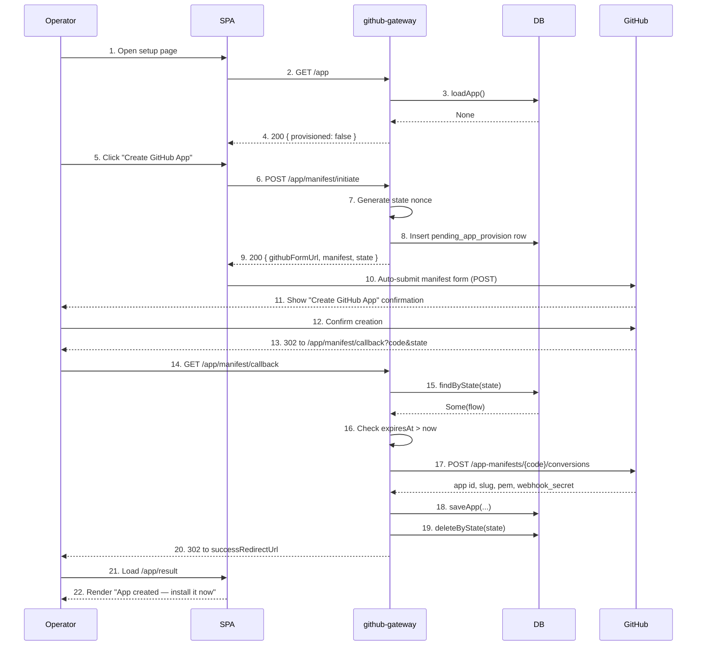
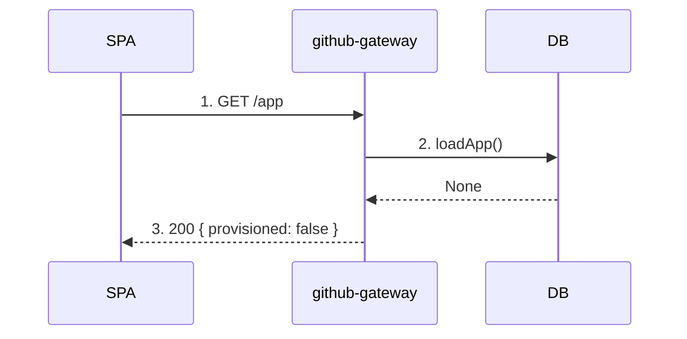
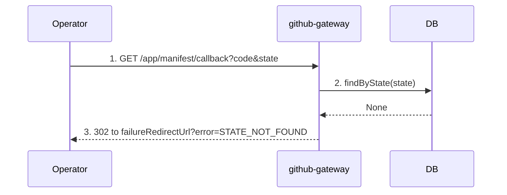
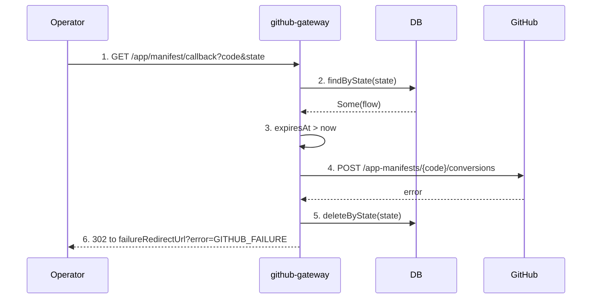
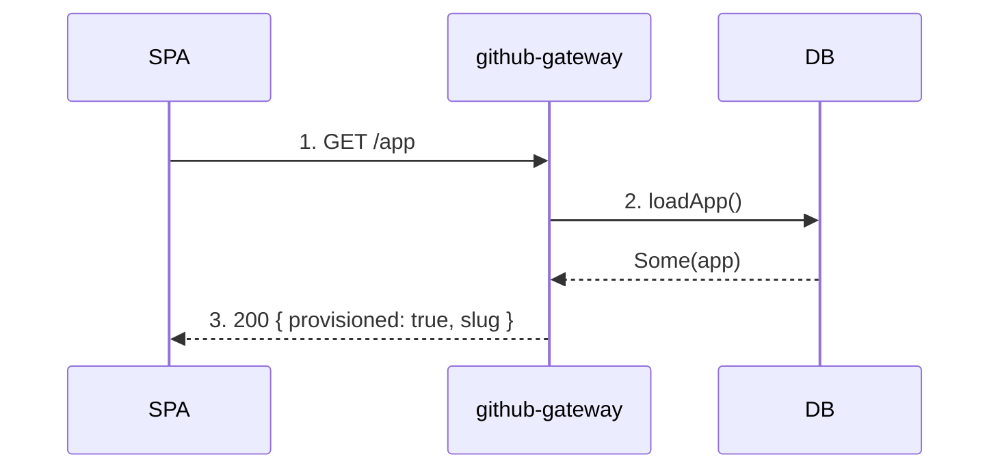

# App provisioning flow

> **Status: planned.** This flow does not exist yet. It is the front door we are adding
> so that a UBC deployment creates and owns its **own** GitHub App instead of depending on
> a centrally-operated, pre-registered app. The numbered steps and code references below
> describe the intended design, not shipped code. New components are called out as such.

Provisioning is a **one-time, per-deployment** bootstrap. Before it runs, the gateway has no
GitHub App credentials and the [linking flow](./linking_flow.md) cannot start. After it runs,
the gateway holds a single stored GitHub App (id, slug, private key, webhook secret) and every
subsequent installation links against that app.

We use GitHub's [App Manifest flow](https://docs.github.com/en/apps/sharing-github-apps/registering-a-github-app-from-a-manifest):
the gateway describes the app it wants as a JSON manifest, GitHub creates the app on the
operator's account/org from that manifest, and GitHub hands back a one-time `code` the gateway
exchanges for the app's credentials. No human ever copies an App ID, private key, or webhook
secret by hand.

This mirrors the linking flow's shape: a single-use `state` nonce guards a server-driven
handshake, and a transient pending row tracks the in-flight request.

## Why this replaces the centralized-app model

Today the four app values — `GITHUB_APP_ID`, `GITHUB_APP_SLUG`, `GITHUB_APP_PRIVATE_KEY_PEM`,
`GITHUB_WEBHOOK_SECRET` — are read once from the environment in `GitHubGatewayConfig`. That
forces every deployment to point at an app *someone else already created and operates*. The
manifest flow removes that dependency: the operator clicks one button, GitHub creates the app
under their own account, and the gateway persists the result. The app becomes **data the
deployment owns**, not **config it inherits**.

## Actors

- **Operator** — the person standing up this UBC deployment, in a browser. Runs provisioning once.
- **SPA** — the Tyrian frontend (`provider-gateways/github-gateway/presentation/src/Main.scala`). Renders the setup page, posts the manifest form to GitHub, renders the result.
- **github-gateway** — the JVM service. Builds the manifest, issues the `state` nonce, exchanges the code, owns the stored app record.
- **DB** — Postgres. Holds the transient `pending_app_provision` row (**new**) and the durable `github_app` row (**new**).
- **GitHub** — external. Hosts the app-creation UI, redirects back with the code, serves the manifest-conversion endpoint.

Activity-log emission is omitted from the diagrams, matching the linking-flow doc's convention.

## 1. Happy path

End-to-end: the operator opens the setup page, GitHub creates the app from the gateway's
manifest, and the gateway stores the resulting credentials. After this completes the operator
proceeds to the [linking flow](./linking_flow.md) to install the new app on an org.



1. Operator opens the setup page in the SPA. **(new view)**
2. SPA asks the gateway whether an app is already provisioned. **(new endpoint `GET /app`)**
3. Gateway loads the stored app record. **(new port `GitHubAppRepository.loadApp`)**
4. No row exists; gateway reports `provisioned: false`. The SPA shows the create-app call to action. (If a row *did* exist, see [§5 Already provisioned](#5-already-provisioned).)
5. Operator clicks "Create GitHub App".
6. SPA calls the gateway to begin provisioning. **(new endpoint `POST /app/manifest/initiate`)**
7. Gateway generates a fresh single-use `state` nonce via the `SecureRandom` port, reusing the linking flow's nonce mechanism.
8. Gateway inserts a `pending_app_provision` row keyed by `state`, with `expiresAt = now + pendingProvisionTtl`. **(new table + port, modeled on `PendingLinkFlowRepository`)**
9. Gateway returns the GitHub form URL, the manifest JSON, and the `state`. `githubFormUrl` is `https://github.com/settings/apps/new?state=<state>` for a personal account, or `https://github.com/organizations/<org>/settings/apps/new?state=<state>` for an org. The manifest is built from the deployment's public base URL (see [Manifest contents](#manifest-contents)).
10. SPA renders a self-submitting HTML form that POSTs the `manifest` field to `githubFormUrl`. (The manifest flow requires a form POST, not a redirect — GitHub reads the manifest from the request body.)
11. GitHub parses the manifest and shows the operator a pre-filled "Create GitHub App" confirmation page.
12. Operator reviews permissions/events and confirms.
13. GitHub creates the app on the operator's account/org and redirects to the manifest's `redirect_url` with a one-time `code` and the echoed `state`.
14. Browser follows the redirect to the gateway. **(new endpoint `GET /app/manifest/callback`)**
15. Gateway looks up the pending row by `state`.
16. Gateway verifies `flow.expiresAt > now`.
17. Gateway exchanges the one-time code: `POST https://api.github.com/app-manifests/{code}/conversions`. **(new method on `GitHubAppClient`)** The code is valid for one hour and single-use.
18. Gateway persists the returned `id`, `slug`, private-key `pem`, and `webhook_secret` as the singleton `github_app` row. The private key and webhook secret are marked `Sensitive` so they redact in logs. **(new port `GitHubAppRepository.saveApp`)**
19. Gateway deletes the pending row. This runs through `acquireReleaseWith` so the row is removed on every exit path from step 16 onward, exactly as the linking flow handles `pending_link_flow`.
20. Gateway responds with 302 to `successRedirectUrl`.
21. Browser loads the success URL, served by the SPA. **(new `/app/result` view)**
22. SPA renders confirmation and points the operator at the linking flow to install the freshly-created app.

## Manifest contents

The manifest the gateway POSTs in step 9 declares everything GitHub needs to create the app.
All URLs derive from a single new deployment config value (the gateway's public base URL),
replacing the four app secrets that used to live in config.

```json
{
  "name": "ubc-<deployment-name>",
  "url": "<publicBaseUrl>",
  "hook_attributes": { "url": "<publicBaseUrl>/webhooks/github" },
  "redirect_url": "<publicBaseUrl>/app/manifest/callback",
  "public": false,
  "default_permissions": { "contents": "read", "metadata": "read" },
  "default_events": ["installation", "installation_repositories", "repository"]
}
```

- `hook_attributes.url` is the existing webhook endpoint — unchanged. GitHub generates the webhook secret during conversion and returns it in step 17, so the secret is created *with* the app rather than configured ahead of it.
- `redirect_url` is the new provisioning callback from step 14.
- `default_permissions` / `default_events` should match exactly what the linking flow and webhook handler already rely on; the manifest is the single source of truth for the app's capabilities.
- `state` is **not** part of the manifest body — it rides on the `githubFormUrl` query string and GitHub echoes it back on the callback.

## 2. Status check — not provisioned

The standalone read the SPA uses to decide whether to show provisioning or the link button.
Drawn separately because it gates everything else.



1. SPA requests app status on load.
2. Gateway loads the stored app record.
3. No row exists; gateway reports `provisioned: false`. The SPA renders the create-app call to action and hides linking.

## 3. Callback — state not found

The supplied `state` matches no pending row: the callback was already consumed, the row was
swept after expiry, or the request is fabricated. Identical in spirit to the linking flow's
state-not-found case.



1. Browser arrives from GitHub (or replays an old callback).
2. Gateway looks up the pending row.
3. No row matched; gateway fails and the controller maps it to a 302 with `?error=STATE_NOT_FOUND`. No row exists to delete.

## 4. Callback — conversion failure

The pending row is valid, but exchanging the one-time code with GitHub fails (expired/used
code, or a GitHub-side error). The gateway aborts and clears the pending row; no app is stored.



1. Browser arrives from GitHub with the code.
2. Gateway finds the pending row.
3. Expiry passes; gateway begins the exchange.
4. The conversion call fails.
5. Bracket cleanup deletes the pending row regardless of how far the exchange got. No `github_app` row is written.
6. Controller responds with 302 + `?error=GITHUB_FAILURE`. The operator can retry from the setup page.

## 5. Already provisioned

Provisioning is a one-time action. Once a `github_app` row exists, the status check reports it
and the SPA skips straight to linking. Re-running provisioning would orphan the existing app on
GitHub, so the initiate endpoint refuses while a row is present.



1. SPA requests app status.
2. Gateway loads the stored app record and finds it.
3. Gateway reports `provisioned: true` with the app slug. The SPA hides provisioning and shows the linking flow. A `POST /app/manifest/initiate` in this state is rejected rather than starting a second app.

## Pending row lifecycle

The `pending_app_provision` row mirrors `pending_link_flow`. Exactly one of the following ends
every row's life:

- **Successful callback** — deleted in step 19 of the happy-path diagram.
- **Conversion-failure callback** — deleted in step 5 of the conversion-failure diagram.
- **Expired callback** — deleted by the expiry guard before the exchange (same shape as the linking flow's state-expired case).
- **Sweep** — the existing periodic sweep should be extended to clear expired `pending_app_provision` rows alongside `pending_link_flow`, so an abandoned (closed-tab) provisioning attempt eventually disappears.

Single-use is enforced by deletion on every callback exit path; replaying a successful callback
falls into the state-not-found path.

## What changes elsewhere

This flow is additive, but it forces three downstream changes, documented here so the data flow
is fully visible:

1. **`GitHubGatewayConfig` loses the four app values.** `GITHUB_APP_ID`, `GITHUB_APP_SLUG`, `GITHUB_APP_PRIVATE_KEY_PEM`, and `GITHUB_WEBHOOK_SECRET` are deleted. A single `PUBLIC_BASE_URL` is added to build manifest URLs. Remaining knobs (success/failure URLs, TTLs, sweep interval) stay.
2. **App credentials are resolved from storage at runtime.** Everywhere the linking flow and webhook handler read `config.app*` today — the install URL in `initiate`, the App JWT mint in the callback, the HMAC verification on webhooks — they instead load the stored `github_app` row. See the updated [linking flow](./linking_flow.md).
3. **Linking is gated on provisioning.** `POST /links/initiate` requires a stored app; with none present it fails fast and the SPA shows provisioning instead of the link button.
