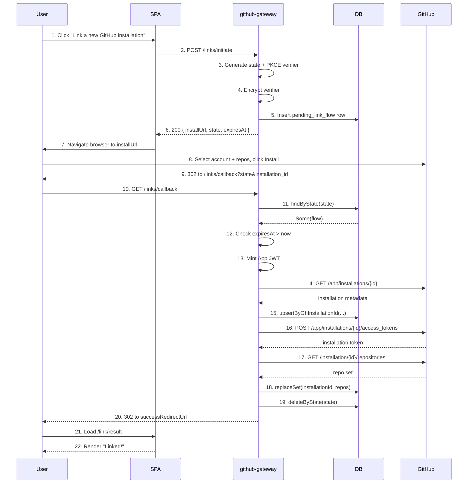
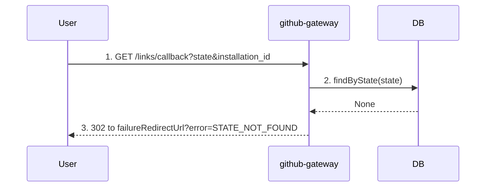
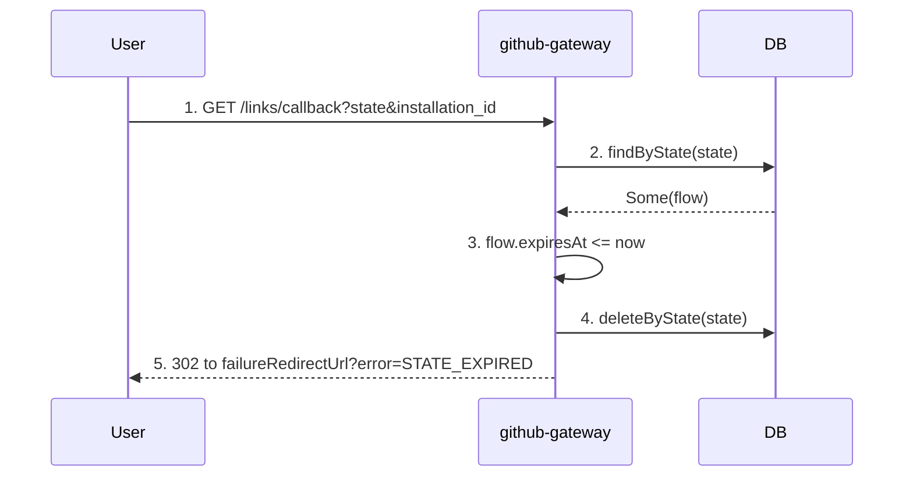
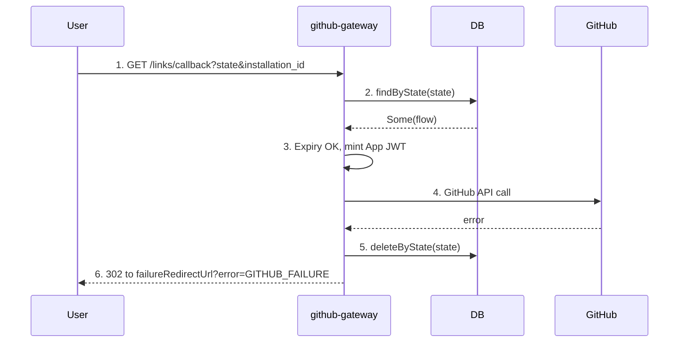
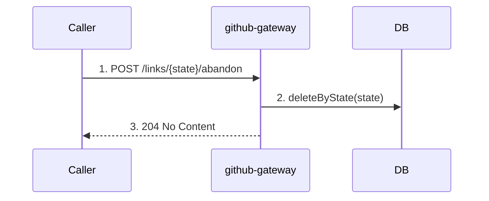
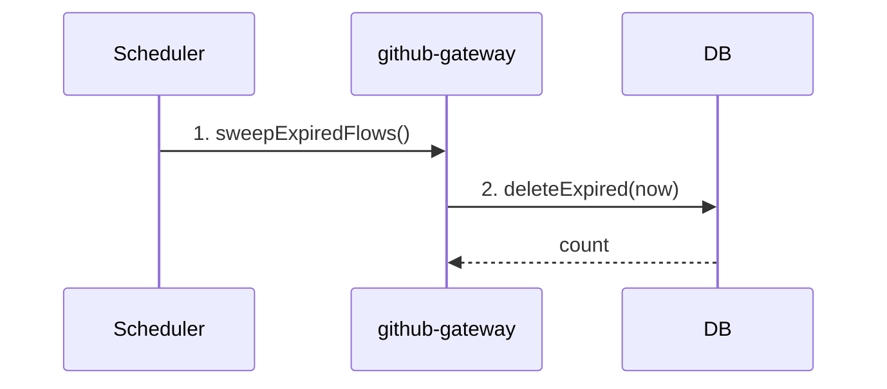

# Linking flow

The linking flow connects a UBC user to a GitHub App installation (an account or org on GitHub) and mirrors that installation's selected-repo set into the gateway's database. It is the only way an installation enters our system; once linked, webhooks and reconcile jobs keep the mirror in sync.

The flow is a server-driven OAuth-style handshake with PKCE:

- The gateway issues a single-use `state` nonce and a PKCE `verifier`/`challenge` pair.
- The user is redirected to GitHub to install the app.
- GitHub redirects back with `state` + `installation_id`; the gateway consumes the pending row, calls GitHub as the App, and persists the installation + repos.

## Actors

- **User** — a person in a browser. Drives the flow and consumes the SPA.
- **SPA** — the Tyrian frontend at `provider-gateways/github-gateway/presentation/src/Main.scala`. Initiates the link, renders the result page after callback.
- **github-gateway** — the JVM service. Generates the nonce, persists the pending row, calls GitHub as the App, owns the installation/repo mirror.
- **DB** — Postgres. Holds `pending_link_flow` (transient) plus `installation` and `linked_repo` (durable mirror).
- **GitHub** — external. Hosts the install UI, redirects back to the callback, serves App and Installation REST endpoints.

Activity-log emission is intentionally omitted from the diagrams. Logs are observability, not flow logic; see `core/core-impl/src/ubc/githubgateway/core/Activity.scala` for the events.

## 1. Happy path

End-to-end: the user starts the link from the SPA, completes the install on GitHub, and lands back on the SPA with the installation linked and its repo set mirrored.

1. User clicks the "Link a new GitHub installation" button on the SPA Home view (`presentation/src/Main.scala:104`).
2. SPA calls `POST /links/initiate` against the gateway (`api/api-defn/.../GitHubGatewayApi.scala:27`).
3. Gateway generates a fresh `LinkState` nonce and a PKCE `CodeVerifier` via the `SecureRandom` port; computes `CodeChallenge = base64url(SHA-256(verifier))` (`core/core-impl/.../GitHubGatewayService.scala:78-82`).
4. Gateway encrypts the verifier with the `Crypto` port so it is stored opaquely (`GitHubGatewayService.scala:83`).
5. Gateway inserts a `PendingLinkFlow` row keyed by `state`, with `expiresAt = now + pendingLinkTtl` (`GitHubGatewayService.scala:86-93`, `core/ports/.../PendingLinkFlowRepository.scala:20`).
6. Gateway returns `LinkInitiation { installUrl, state, expiresAt }` where `installUrl = https://github.com/apps/<appSlug>/installations/new?state=<state>`.
7. SPA performs a full-page navigation to `installUrl` via `Nav.loadUrl` (`presentation/src/Main.scala:113`).
8. The user picks the account/org to install on and the repo set, then confirms.
9. GitHub redirects to the configured callback URL with `state` and `installation_id` query parameters.
10. Browser follows the redirect to the gateway (`api/internal-api-adapters/http/.../GitHubGatewayHttpController.scala:52`).
11. Gateway looks up the pending row by `state` (`GitHubGatewayService.scala:113`).
12. Gateway verifies `flow.expiresAt > now` (`GitHubGatewayService.scala:124-126`).
13. Gateway mints a short-lived RS256 App JWT signed with the GitHub App private key (`InstallationTokenMinter`, implemented by `NimbusJoseInstallationTokenMinter`).
14. Gateway calls `GET /app/installations/{installation_id}` to fetch installation metadata (`core/ports/.../GitHubAppClient.scala:26`).
15. Gateway upserts the local installation row by `GhInstallationId`, getting back the persisted row with our local surrogate id.
16. Gateway exchanges the App JWT for a short-lived installation access token (`GitHubAppClient.scala:51`).
17. Using the installation token, gateway fetches the selected-repo set (`GitHubAppClient.scala:31`).
18. Gateway replaces the local mirror's repo set for this installation, recording `(added, removed, renamed)` counts.
19. Gateway deletes the pending row. This runs through `acquireReleaseWith` so the row is removed on **every** exit path from step 12 onward (`GitHubGatewayService.scala:120-122`).
20. Gateway responds with 302 to `successRedirectUrl` (`GitHubGatewayHttpController.scala:135`).
21. The browser loads the success URL, which is served by the SPA at `/link/result`.
22. SPA detects the `/link/result` path, sees no `?error` parameter, replaces the history entry with `/`, and renders the success view (`presentation/src/Main.scala:41-46, 184-200`).

## 2. Callback — state not found

The supplied `state` matches no pending row. Possible causes: the callback was already consumed, the row was swept after expiry, or the request is fabricated.

1. Browser arrives from GitHub (or is replaying an old callback).
2. Gateway looks up the pending row (`GitHubGatewayService.scala:113`).
3. No row matched — gateway fails with `LinkError.StateNotFound` (`GitHubGatewayService.scala:117-118`); the HTTP controller maps that to a 302 to `failureRedirectUrl?error=STATE_NOT_FOUND` (`GitHubGatewayHttpController.scala:138`). No row exists to delete.

## 3. Callback — state expired

The pending row exists but its `expiresAt` has passed. The gateway rejects the callback and clears the stale row.

1. Browser arrives from GitHub.
2. Gateway looks up the pending row.
3. Row found, but `expiresAt <= now` — gateway fails with `LinkError.StateExpired` (`GitHubGatewayService.scala:124-126`).
4. Bracket cleanup removes the stale pending row (`GitHubGatewayService.scala:120-122`).
5. HTTP controller responds with 302 + `?error=STATE_EXPIRED` (`GitHubGatewayHttpController.scala:140`).

## 4. Callback — GitHub failure

The pending row is valid, but a GitHub-side call (App JWT mint, `getInstallation`, `createInstallationToken`, or `listInstallationRepos`) fails. The gateway aborts and cleans up.

1. Browser arrives from GitHub.
2. Gateway looks up the pending row, finds it.
3. Expiry passes; gateway begins GitHub-side work.
4. One of the four GitHub calls (`mintAppJwt`, `getInstallation`, `createInstallationToken`, `listInstallationRepos`) fails. The error is mapped to `LinkError.GitHubFailure(message)` via `asGitHubFailure` (`GitHubGatewayService.scala:52-53`).
5. Bracket cleanup deletes the pending row regardless of how far the GitHub-side work got (`GitHubGatewayService.scala:120-122`). Local installation/repo state may have been partially upserted; the next reconcile run corrects it.
6. HTTP controller responds with 302 + `?error=GITHUB_FAILURE` (`GitHubGatewayHttpController.scala:142`).

## 5. Abandon

A caller (typically the SPA, but the endpoint is open to any authenticated client) drops a pending link request without going through GitHub. Idempotent.

1. Caller sends `POST /links/{state}/abandon` (`GitHubGatewayHttpController.scala:64-67`).
2. Gateway deletes the pending row by state (`GitHubGatewayService.scala:163`). No-op if no row exists.
3. Gateway responds 204.

## 6. Sweep

A periodic background job clears pending rows whose `expiresAt` has passed. This guarantees a stale row from an abandoned-by-the-user (closed-tab) flow eventually disappears even if no callback or abandon arrives.

1. A scheduled job in `server/src/Server.scala` triggers the sweep on a fixed cadence.
2. Gateway calls `pendingFlows.deleteExpired(now)` (`GitHubGatewayService.scala:261-266`, `PendingLinkFlowRepository.scala:37`). Returns the number of rows removed.

## Pending row lifecycle

The `pending_link_flow` row is the spine of the flow. Exactly one of the following ends every row's life:

- **Successful callback** — deleted in step 19 of the happy-path diagram.
- **Expired callback** — deleted in step 4 of the state-expired diagram.
- **GitHub-failure callback** — deleted in step 5 of the GitHub-failure diagram.
- **Abandon** — deleted in step 2 of the abandon diagram.
- **Sweep** — deleted in step 2 of the sweep diagram, for rows where the user never came back.

Single-use is enforced by deletion on every callback exit path (via `acquireReleaseWith` in `GitHubGatewayService.scala:120-122`); replay of a successful callback then falls into the state-not-found path.
